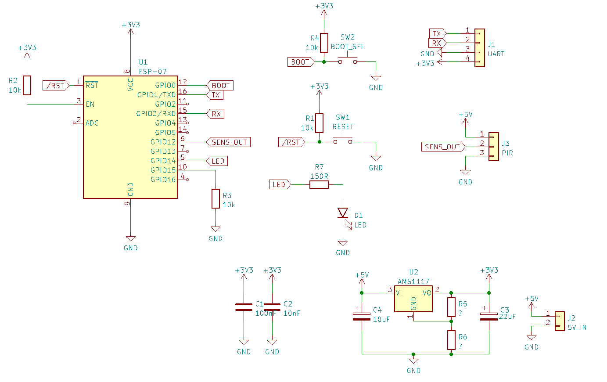

# ES-PIR-esence

A small circuit to detect presence with an ESP8266 module and a PIR sensor.
My idea is to use ESPHome to connect the circuit to HomeAssistant for home automation or security.

Schematic:

Layout:

---

ES-PIR-esence (c) by HA5PLS

ES-PIR-esence is licensed under a
Creative Commons Attribution-ShareAlike 4.0 International License.

You should have received a copy of the license along with this
work. If not, see <http://creativecommons.org/licenses/by-sa/4.0/>.

